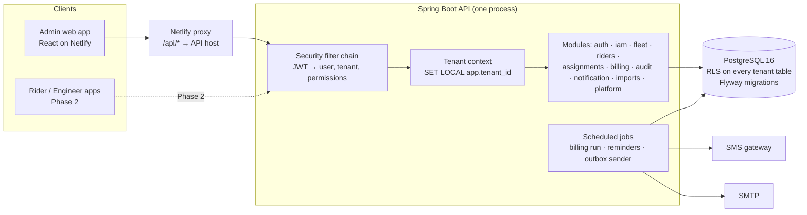
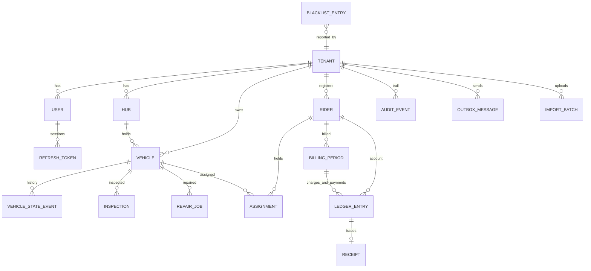

# Backend Architecture — EV Rental Platform (Phase 1)

**Status:** Proposed, for SMK review. Nothing here is built yet; `backend/` is empty.
**Companion:** [`ARCHITECTURE.md`](./ARCHITECTURE.md) is the one-page shape of the whole
system. This file is the backend in depth: every decision, why we made it, what we
rejected, and what can bite us.
**Source of truth for the API:** `frontend/app/src/types/` and `frontend/app/src/lib/api/`.
The backend is built to satisfy those files, not the other way round.

---

## 0. How to read this

Every decision below follows the same four lines:

- **Decision** — what we do.
- **Why** — in plain words.
- **Rejected** — what else we could have done and why not.
- **Watch out** — the caveat that will hurt if forgotten.

Skip to §12 for the table of everything we are deliberately *not* building in Phase 1,
and to **§15 for the caveats** — the things that will hurt if we forget them, including
six that must be settled before the code that depends on them is written.

Who builds what, in what order, is a separate file:
[`BACKEND_WORKSPLIT.md`](./BACKEND_WORKSPLIT.md).

### Plain-words glossary

| Word | Means |
|---|---|
| **Tenant** | One fleet company (Ashok's G1 Mobility is one tenant). Each tenant sees only its own data. |
| **RLS** (Row-Level Security) | A PostgreSQL feature: the database itself refuses to return rows that don't belong to the current tenant. Even buggy code cannot leak another tenant's rows. |
| **JWT** | A signed token the client sends with every request. It says "this is user X, tenant Y, role Z" and cannot be forged because it is signed by our key. |
| **Access token / refresh token** | Access token: short-lived (15 min) JWT sent on every call. Refresh token: long-lived (7 days), used only to get a new access token. If an access token is stolen, it dies in 15 minutes. |
| **Idempotency key** | A unique id the client sends with a money request. If the same request arrives twice (double-click, retry), the server does it once and returns the same answer. |
| **Ledger** | A bank-statement style table: every rupee movement is one new row, never edited. Balance = sum of rows. |
| **Outbox** | Instead of sending an SMS directly, we write "send this SMS" as a row in the same database transaction as the change. A background worker sends it. Nothing is lost if the SMS gateway is down. |
| **Migration** | A numbered SQL file that changes the database schema. Run in order, never edited after merge. Flyway is the tool. |
| **Modular monolith** | One deployable app, internally split into modules with enforced boundaries. Cheap to run now, can be split into services later if ever needed. |
| **Paise** | Smallest unit of the rupee. All money is stored and sent as whole paise (integer). ₹1,250.50 = 125050. |

---

## 1. Shape of the system



One process, one database. That is deliberate and is the single biggest cost saver
for a two-person part-time team.

---

## 2. Runtime and framework

**Decision.** Java 21 (LTS), Spring Boot 3.5.x, Maven, PostgreSQL 16, Flyway, Spring
Modulith for module boundaries, springdoc-openapi for the API spec.

**Why.** The stack was locked in BUILD.md and the original Phase 1 plan; SMK owns the
backend and knows it. Spring Security, Flyway, Testcontainers and the JDBC/Postgres
stack are the most battle-tested pieces in this space. Spring Modulith gives us
enforced module boundaries and a built-in transactional event log (see §7) without
adding infrastructure.

**Rejected.**
- *Node/NestJS to match the frontend language.* Attractive because both halves would
  be TypeScript, but it re-opens a locked decision, and Spring's security and
  multi-tenant story is stronger out of the box. We share types through OpenAPI
  instead (§8), which gets 90% of the "same language" benefit.
- *Spring Boot 4.x.* Too new for a system that moves money; 3.5 is the mature line
  and Modulith 1.4 targets it.
- *Kotlin.* Nice, but adds a language to learn for whoever picks this up next.

**Watch out.** Pin exact versions in `pom.xml`. Dependabot or Renovate opens the
bump PRs; CI proves they are safe.

---

## 3. Multi-tenancy

**Decision.** Shared database, shared schema. Every tenant-owned table has
`tenant_id uuid NOT NULL`. PostgreSQL Row-Level Security enforces isolation. The API
sets `SET LOCAL app.tenant_id = '<uuid>'` at the start of every transaction, from the
JWT — never from a request parameter or header the client controls.

**Why.** We have one real tenant today and expect tens, not thousands. RLS means the
*database* is the guard: a forgotten `WHERE tenant_id = ?` returns zero rows instead
of another company's bikes. It costs nothing to run and no code per query.

**Rejected.**
- *Schema per tenant.* Migrations run N times, connection pools fragment, cross-tenant
  reads (the shared blacklist) get awkward. Right answer at 500+ tenants; wrong at 5.
- *Database per tenant.* Same, worse.
- *Application-level filtering only.* One missed `WHERE` is a data breach.

**Watch out — these are the ones that actually bite.**

1. **Table owners and superusers bypass RLS.** Use two database roles:
   `fleetech_migrator` owns the tables and runs Flyway; `fleetech_app` is what the
   API connects as, has `NOBYPASSRLS`, and owns nothing. Also set
   `ALTER TABLE … FORCE ROW LEVEL SECURITY` so even the owner is subject to policies.
   Test this: a test that connects as `fleetech_app` with the wrong tenant id and asserts
   zero rows is mandatory in CI.
2. **`SET LOCAL` only lives inside a transaction.** Every request — including GETs —
   runs inside `@Transactional` (read-only for reads). The tenant setting is applied by a
   hook right after the transaction begins. Because it is `LOCAL`, it vanishes when the
   transaction ends, so a pooled connection handed to the next request carries nothing
   over. Never use plain `SET` (session-wide) — with a connection pool that is a leak.
3. **Fail closed.** The policy is
   `USING (tenant_id = NULLIF(current_setting('app.tenant_id', true), '')::uuid)`. If the
   setting was never applied, the comparison is NULL and the query returns nothing. A bug
   produces an empty screen, not a leak. The `NULLIF` is not decoration: once a custom
   setting has been used on a pooled connection, Postgres reports it as an empty string
   (not NULL) after the transaction ends, and `''::uuid` throws
   `invalid input syntax for type uuid`. Without `NULLIF` the second request on every
   connection would 500.
4. **Super-admin bypass is explicit.** Platform endpoints set
   `SET LOCAL app.bypass_rls = 'on'` and the policy has
   `OR current_setting('app.bypass_rls', true) = 'on'`. Only the `platform` module may
   set it, and only when the JWT carries `SUPER_ADMIN`. An ArchUnit test forbids any other
   module from touching that setting.
5. **Cross-tenant tables.** `tenants`, `plans`, `blacklist_entries` and platform-level
   `users` are not tenant-scoped and have no RLS policy; they are the short, named list
   of exceptions.
6. **RLS applies to reads and writes.** A `WITH CHECK` clause on the same policy stops
   an insert with the wrong `tenant_id`. The service layer still stamps `tenant_id` from
   context, never from the request body.

---

## 4. Authentication

**Decision.** Spring Security with our own `users` table. Password login for staff.
Short-lived JWT access token (15 min) signed with an asymmetric key (ES256).
Long-lived opaque refresh token (7 days), stored hashed, rotated on every use,
with reuse detection. Web clients receive the refresh token as an `HttpOnly`,
`Secure`, `SameSite=Strict` cookie; mobile clients (Phase 2) receive it in the response
body and store it in the OS keychain. Passwords hashed with Argon2id via Spring's
`DelegatingPasswordEncoder` so the algorithm can change later without a migration.

**Why.**
- *Own users table, not an identity provider:* riders in Phase 2 will log in by phone
  OTP, tenants will invite staff by email, and super admins manage all of it inside
  the product. A hosted IdP (Auth0, Cognito, Keycloak) becomes a second admin surface
  and a monthly bill for a feature we need to control tightly anyway.
- *Asymmetric signing:* any future service or app can verify a token with the public
  key (published at `/.well-known/jwks.json`) without holding the secret. Rotating a
  key pair does not log everyone out.
- *Refresh in an HttpOnly cookie for web:* JavaScript cannot read it, so an XSS bug
  cannot steal the long-lived credential. The access token lives only in memory.
- *Rotation + reuse detection:* every refresh issues a new token and revokes the old
  one. If a revoked token is presented again, the whole token family is revoked and
  the user is signed out everywhere — the standard answer to a stolen refresh token.

**Rejected.**
- *Keycloak.* Excellent, but it is another server to run, back up and upgrade for a
  team of two.
- *Sessions with a server-side store.* Fine for web only; the Phase 2 mobile apps
  want tokens. Doing tokens now means one auth story, not two.
- *Symmetric HS256 JWT.* Simpler, but every verifier needs the secret. Asymmetric
  costs one extra config value.

**Watch out.**
- **Cookies and cross-origin.** A `SameSite=Strict` cookie only works if the frontend and
  API share a site. The Netlify frontend proxies `/api/*` to the API host (a rewrite in
  `public/_redirects`), so the browser sees one origin. This also removes CORS from the
  browser path entirely. CORS config still exists, allow-listed, for local dev and tools.
- **Login rate limiting.** `/auth/login`, `/auth/refresh` and password reset get a
  per-IP and per-account bucket (Bucket4j, in-memory in Phase 1). Failed logins are
  audited.
- **Clock skew.** Allow 60 seconds of leeway when validating `exp`.
- **Token claims are minimal:** `sub` (user id), `tid` (tenant id, absent for super
  admin), `role`, `kind` (`STAFF` now, `RIDER` / `ENGINEER` later), `jti`. Permissions
  are *not* in the token — they are derived server-side from the role so a role change
  takes effect on the next request, not after 15 minutes.
- **Never log a token.** The request-logging filter redacts `Authorization` and
  `Set-Cookie`.

### Login flow

```mermaid
sequenceDiagram
  participant B as Browser
  participant A as API
  participant DB as Postgres
  B->>A: POST /auth/login {email, password}
  A->>DB: find user by email (platform or tenant)
  A->>A: Argon2 verify
  A->>DB: insert refresh_tokens (hash, family, expires)
  A-->>B: 200 {accessToken, user, tenant} + Set-Cookie refresh
  B->>A: GET /vehicles  Authorization: Bearer <access>
  A->>A: verify signature, exp; load role
  A->>DB: BEGIN; SET LOCAL app.tenant_id; SELECT …; COMMIT
  A-->>B: 200 page
  Note over B,A: 15 min later access expires
  B->>A: POST /auth/refresh (cookie)
  A->>DB: lookup hash; check not revoked; revoke old; insert new
  A-->>B: 200 {accessToken} + new cookie
```

---

## 5. Authorisation

**Decision.** Four roles, exactly the ones the frontend already has:
`SUPER_ADMIN`, `TENANT_ADMIN`, `FLEET_STAFF`, `SERVICE_MANAGER`. Roles map to a fixed set
of **permissions** in code (an enum, e.g. `VEHICLE_READ`, `VEHICLE_WRITE`, `RIDER_WRITE`,
`ASSIGNMENT_WRITE`, `PAYMENT_RECORD`, `PAYMENT_READ`, `QC_DECIDE`, `USER_MANAGE`,
`AUDIT_READ`, `PLATFORM_MANAGE`). Controllers guard with
`@PreAuthorize("hasAuthority('PAYMENT_RECORD')")`, never with a role name.

**Why.** Guarding on permissions rather than roles means Phase 2 can add `RIDER` and
`FIELD_ENGINEER` roles by adding rows to a mapping, not by editing every controller.
The nav in `frontend/app/src/app/nav.ts` already implies the matrix; the backend makes
it real (BUILD.md H2 says RBAC is cosmetic today — this is where it stops being so).

**Rejected.** *Database-driven permissions editable per tenant.* Flexible, but nobody
has asked for it and it turns every authorisation bug into a data question. An enum
in code is reviewable in a PR.

**Watch out.** `ARCHITECTURE.md` still lists three roles. This document supersedes it;
`SERVICE_MANAGER` sees fleet, inspection, service and QC only (no riders, no money).

Permission matrix (initial):

| Permission | SUPER_ADMIN | TENANT_ADMIN | FLEET_STAFF | SERVICE_MANAGER |
|---|---|---|---|---|
| DASHBOARD_READ, VEHICLE_READ | ✓ | ✓ | ✓ | ✓ |
| VEHICLE_WRITE, INSPECTION_WRITE | ✓ | ✓ | ✓ | ✓ |
| QC_DECIDE | ✓ | ✓ | – | ✓ |
| RIDER_READ, RIDER_WRITE, ASSIGNMENT_WRITE | ✓ | ✓ | ✓ | – |
| PAYMENT_READ, PAYMENT_RECORD | ✓ | ✓ | – | – |
| USER_MANAGE, AUDIT_READ | ✓ | ✓ | – | – |
| PLATFORM_MANAGE (tenants, plans) | ✓ | – | – | – |

Super admin acting inside a tenant (support case) does so by explicitly "entering"
a tenant: the token is re-issued with that `tid` and the action is audited as
`actor = super admin, on behalf of tenant`. There is no silent god-mode.

---

## 6. Data model

**Decision.** Normalised PostgreSQL schema. Internal primary keys are `uuid` (v7,
time-ordered, **generated in Java** — `uuidv7()` is PostgreSQL 18 and we are on 16, and
a managed instance may not let us install `pg_uuidv7`). Human-facing ids
(`BLRSS0428`, `R01`) are separate `code` columns,
unique per tenant, and are what the API exposes as `id` because that is what the
frontend routes and screens already use. Every state change and every rupee is an
append-only row. Current state is denormalised onto the parent row (`vehicles.state`)
and updated in the same transaction as the event row.

**Why.**
- *uuid inside, code outside:* a registry code may need correcting (typo at induction);
  foreign keys should not care. UUIDv7 sorts by time so indexes stay compact.
- *Append-only history:* Ashok's spreadsheet overwrites the rider's vehicle column and
  loses the fact an exchange happened (the types file says this in as many words). We
  keep every event.
- *Denormalised current state:* lists need it fast. Correctness is guaranteed by writing
  both in one transaction, and a nightly check job recomputes and alerts on drift.

**Rejected.**
- *Event sourcing proper (no current-state tables).* Elegant, heavy. Every list becomes
  a fold. Not for a two-person team.
- *Storing `current_rider_id` on `vehicles`.* Two sources of truth (the open
  assignment and the column). We derive it from the open assignment with a view;
  a partial unique index guarantees there is at most one.

### Entity map



### Tables

Tenant-scoped unless marked **global**. All timestamps `timestamptz` in UTC.
Money columns are `bigint` paise, suffixed `_paise`. Enums are `text` with a `CHECK`
constraint (easier to extend than Postgres enum types).

| Table | Key columns | Notes |
|---|---|---|
| `tenants` **global** | `id, slug, name, timezone, status, plan_id, settings jsonb` | `timezone` default `Asia/Kolkata`. `settings` holds dunning thresholds, late-fee rule, SMS templates. |
| `plans` **global** | `id, name, price_paise, limits jsonb` | Subscription plans for tenants. Thin in Phase 1. |
| `users` | `id, tenant_id NULL, email, password_hash, name, role, status, last_active_at` | `tenant_id` NULL only for `SUPER_ADMIN`. Unique `(tenant_id, lower(email))`. |
| `refresh_tokens` | `id, user_id, token_hash, family_id, expires_at, revoked_at, replaced_by_id, user_agent, ip` | Store SHA-256 of the token, never the token. |
| `hubs` | `id, tenant_id, name` | Modelled now, exposed as a plain `hub: string` name so the frontend does not change. Stops "Koramangala" / "koramangla" drift. |
| `vehicles` | `id, tenant_id, code, chassis_number, make, model, battery_type, battery_vendor, hub_id, state, registration_number, motor_number, controller_number, rfid_tag, iot_number, purchase_date, inducted_on, odometer_km, version` | Unique `(tenant_id, code)`, `(tenant_id, chassis_number)`. `version` for optimistic locking. |
| `vehicle_state_events` | `id, tenant_id, vehicle_id, from_state, to_state, cause, occurred_at, actor_user_id, note, ref_id` | Append-only. `cause` ∈ `INDUCTION, ASSIGN, EXCHANGE, DEBOARD, INSPECTION, QC_PASS, QC_FAIL, MANUAL, IMPORT`. `ref_id` points at the assignment / inspection / repair that caused it. |
| `inspections` | `id, tenant_id, vehicle_id, category, notes, estimated_cost_paise, next_state, inspected_at, actor_user_id` | Screen 13. |
| `repair_jobs` | `id, tenant_id, vehicle_id, category, summary, technician, cost_paise, opened_at, closed_at, qc_decision, qc_reason, qc_at, qc_by` | Screen 14 QC queue = `closed_at IS NOT NULL AND qc_decision = 'PENDING'`. Phase 2 field-engineer app writes these directly. |
| `riders` | `id, tenant_id, code, name, phone, whatsapp_phone, alternate_phone, status, kyc_status, aadhaar_last4, aadhaar_hmac, pan_enc, dl_enc, permanent_address, local_address, city, state, pin_code, location_coordinates, platform, platform_rider_id, plan_amount_paise, billing_day, payment_day, payment_mode, onboarded_on, aadhaar_verified, primary_verified, whatsapp_verified, alternate1_verified, version` | Unique `(tenant_id, phone)`, `(tenant_id, aadhaar_hmac)`. Phones normalised to E.164 before storage. |
| `assignments` | `id, tenant_id, rider_id, vehicle_id, started_at, ended_at, end_kind, end_reason, return_condition, note, opened_by, closed_by` | Partial unique indexes: `(vehicle_id) WHERE ended_at IS NULL` and `(rider_id) WHERE ended_at IS NULL`. The database makes "two riders on one bike" impossible. `end_kind` ∈ `EXCHANGE, DEBOARD`. |
| `billing_periods` | `id, tenant_id, rider_id, period_start, period_end, due_on, billing_day, days_billed, plan_amount_paise, per_day_paise, billed_amount_paise, generated_at` | One row per rider per week, generated by the billing job. Frozen at generation. `period_start`/`period_end` are explicit dates, so whichever way Ashok answers the billing-day question the table does not change (§14). |
| `ledger_entries` | `id, tenant_id, rider_id, account, kind, amount_paise, billing_period_id NULL, method NULL, reference NULL, occurred_at, recorded_by, idempotency_key NULL, note` | **Append-only.** `account` ∈ `RENT, DEPOSIT`. `kind` ∈ `RENT_CHARGE, SERVICE_CHARGE, LATE_FEE, ADJUSTMENT, PAYMENT, DEPOSIT_COLLECTED, DEPOSIT_DEDUCTION, DEPOSIT_REFUND`. Charges positive, payments and refunds negative. Balance = `SUM(amount_paise)`. |
| `receipts` | `id, tenant_id, receipt_no, ledger_entry_id, billing_period_id, issued_at` | `receipt_no` from a per-tenant sequence, formatted `RCPT-YYYY-NNNNN`. |
| `blacklist_entries` **global** | `id, reported_by_tenant_id, phone_hmac, aadhaar_hmac, reason, created_at, created_by` | Read across tenants at onboarding to warn; the tenant admin still decides. Stores HMACs, not raw identifiers, so tenants never see each other's PII. |
| `audit_events` | `id, tenant_id NULL, actor_user_id, actor_name, action, entity_type, entity_id, entity_label, before jsonb, after jsonb, occurred_at, request_id` | **Append-only.** Written in the same transaction as the change. |
| `outbox_messages` | `id, tenant_id, channel, recipient, template, payload jsonb, status, attempts, next_attempt_at, sent_at, last_error` | `channel` ∈ `SMS, EMAIL` now, `WHATSAPP, PUSH` later. |
| `import_batches` | `id, tenant_id, kind, file_name, rows jsonb, total_rows, valid_rows, error_rows, status, created_by, created_at, expires_at` | Two-step bulk upload: preview stores the parsed rows; commit imports the valid ones by batch id. |
| `idempotency_keys` | `tenant_id, key, request_hash, response_status, response_body jsonb, created_at` | PK `(tenant_id, key)`. Purged after 24 h. |

**Append-only is enforced by the database, not by discipline:**

```sql
REVOKE UPDATE, DELETE ON ledger_entries, audit_events, vehicle_state_events FROM fleetech_app;
```

The application role physically cannot edit or delete history. A correction is a new
`ADJUSTMENT` row with a note.

### Derived values (never stored)

| Field on the wire | Computed from |
|---|---|
| `Vehicle.currentRiderId / currentRiderName` | open `assignments` row joined to `riders` |
| `Rider.currentVehicleId` | open `assignments` row |
| `Rider.depositHeld` | `SUM(amount_paise) WHERE account = 'DEPOSIT'` |
| `Rider.paymentStatus`, `PaymentPeriodRow.status` | for the current period: `PAID` if paid ≥ due, `PARTIAL` if 0 < paid < due, `OVERDUE` if paid < due and today > `due_on`, else `PENDING` |
| `PaymentPeriodRow.arrears` | unpaid balance of all *earlier* periods |
| `OverdueRider.stage` | `days_overdue` against thresholds in `tenants.settings` (defaults: 1–3 `REMINDER_DUE`, 4–7 `WARNING_1`, 8–14 `WARNING_2`, 15+ `REPOSSESSION_DUE`) |
| `FleetSummary`, `HubUtilisation`, `ServiceQueueCounts`, `RecoveryCounts` | `GROUP BY` over `vehicles` and open periods; cheap at 10k rows, cached 30 s in-process if it ever isn't |

These live in SQL views (`v_vehicle_current`, `v_rider_current`, `v_period_balance`)
so the dashboard tile and the filtered list it links to are computed by the same
statement and cannot disagree — the same rule the frontend mocks already follow.

### Money rules

- `per_day_paise = round(plan / 7)` is *display only*. The billed amount for a
  partial week is `round(plan × days_billed / 7)`, so a full week bills exactly `plan`
  and never `7 × round(plan/7)`, which can be off by a few paise.
- Rounding is half-up, once, at the end of the formula.
- No `double`/`float` anywhere money touches — `long` in Java, `bigint` in SQL,
  `number` (integer) on the wire. Rupees exist only in the UI.
- **Money the client sends is never money the server believes.**
  `DeboardRiderRequest` carries `outstandingRent` and `depositRefund`, both computed in
  the browser. The server recomputes both from the ledger and, if they differ, returns
  `409` with the server's figures rather than writing the client's. The fields stay in
  the contract as the operator's *stated* intent, which is worth auditing; they are not
  an instruction. Same rule for any future settlement screen.

### Identity data (PII)

- **Aadhaar:** never stored in full. We keep `aadhaar_last4` for display and
  `aadhaar_hmac = HMAC-SHA256(aadhaar, server_secret)` for duplicate detection and the
  blacklist. HMAC, not plain hash: a 12-digit space is small enough to brute-force a
  plain SHA-256; the secret makes that impossible without the key.
- **PAN, driving licence:** encrypted at rest with AES-256-GCM using a key from the
  environment (`PII_KEY`). Decrypted only for the detail screen of an authorised user.
  Phase 2 moves the key to a KMS; the column format does not change.
- **Phones:** stored E.164 (`+91…`), searchable. Phone HMAC also goes to the blacklist.
- **Logs:** a redaction filter masks anything matching a phone or 12-digit number.

---

## 7. Modules

**Decision.** One Spring Boot application, split into Spring Modulith modules under
`com.fleetech`. Each module exposes a small public API (a service interface and DTOs);
everything else is package-private. Modulith's `ApplicationModules.verify()` runs in
the test suite and fails the build on a cross-module reach-in.

| Module | Owns | Talks to |
|---|---|---|
| `auth` | login, refresh, logout, password reset, JWT issue/verify, JWKS | `iam` |
| `iam` | users, roles, permissions, invitations | — |
| `tenancy` | tenant context, RLS hook, tenant settings, timezone helpers | — |
| `fleet` | hubs, vehicles, state machine, inspections, repair jobs, QC | `audit` |
| `riders` | rider register, onboarding, KYC flags, PII encryption, blacklist check | `audit`, `shared` |
| `assignments` | assign / exchange / deboard as transactions across rider + vehicle | `fleet`, `riders`, `billing`, `audit` |
| `billing` | periods, ledger, payments, receipts, overdue, dunning stages, the weekly run | `audit`, `notification` |
| `dashboard` | read-only aggregates for screens 2, 21, 22, 23 | reads views only |
| `audit` | append-only audit trail, list endpoint | — |
| `notification` | outbox table, SMS/email adapters, sender job, templates | — |
| `imports` | `.xlsx` parse, preview, commit (vehicles now, riders next) | `fleet`, `riders` |
| `platform` | super admin: tenants, plans, inquiries, cross-tenant analytics, RLS bypass | `tenancy` |
| `shared` | cross-tenant blacklist read/write | — |
| `common` | Problem Details, paging DTO, money type, ids, clock | used by all |

**Why.** Boundaries are what make the code splittable later and testable now. Modulith
enforces them at build time — otherwise "modules" are a folder naming convention that
erodes in a month.

**Two ways modules talk, and when to use which — in simple words:**

1. **Direct call, same transaction** — when both things must be true together or
   neither. Assigning a bike sets the vehicle to `DEPLOYED` *and* opens the assignment;
   if either fails, both roll back. `assignments` calls `fleet.transition(...)` directly.
2. **Event, after commit** — when it is fine for the second thing to happen a moment
   later. After a deboard commits, `RiderDeboarded` is published; `billing` closes the
   period pro-rata, `notification` queues the settlement SMS. Modulith's event
   publication registry writes the event to the database in the same transaction, so a
   crash between commit and handler does not lose it; it is replayed on restart.

**Rejected.** *Microservices.* Nine tiny services, nine deploys, network calls where a
method call would do, distributed transactions for "assign a bike". No.

---

## 8. API contract

**Decision.** REST under `/api/v1`, JSON, kebab-free camelCase matching `src/types/`.
Errors are RFC 9457 Problem Details with one extension field, `field`, so they map
onto the frontend's existing `ApiError { message, status, field }`. Pagination returns
exactly the frontend's `Page<T>` shape (`content, page, size, totalElements,
totalPages`) via our own DTO, not Spring's `PageImpl` (whose JSON shape is unstable).
springdoc generates OpenAPI 3.1 at build time; CI runs `openapi-typescript` on it and
diffs against `frontend/app/src/types/` — a drift fails the build.

**Why.** The frontend is done and tested against these shapes. The cheapest backend is
the one that fits the socket already on the wall. Generating types from the spec is
what lets Phase 2 mobile clients (Kotlin/Swift/Dart generators) start from the same
truth.

**Rejected.** *GraphQL.* Solves over-fetching we don't have, adds a schema language and
a security surface (query depth, N+1). *gRPC.* Not browser-native.

**Endpoints** (derived one-for-one from `frontend/app/src/lib/api/*.ts`):

| Method & path | Permission | Module | Frontend function |
|---|---|---|---|
| `POST /auth/login`, `/auth/refresh`, `/auth/logout`, `/auth/forgot`, `/auth/reset` | public | auth | — |
| `GET /auth/me` | any | auth | session |
| `GET /vehicles?page&size&q&state&hub&make&batteryType` | VEHICLE_READ | fleet | `listVehicles` |
| `GET /vehicles/facets?q&hub&make&batteryType` | VEHICLE_READ | fleet | `vehicleFacets` |
| `GET /vehicles/filter-options` | VEHICLE_READ | fleet | `vehicleFilterOptions` |
| `GET /vehicles/{code}` | VEHICLE_READ | fleet | `getVehicle` |
| `POST /vehicles` | VEHICLE_WRITE | fleet | `createVehicle` |
| `POST /vehicles/imports` (multipart) → preview | VEHICLE_WRITE | imports | `previewBulkUpload` |
| `POST /vehicles/imports/{batchId}/commit` | VEHICLE_WRITE | imports | `commitBulkUpload` |
| `GET /vehicles/inspectable` | INSPECTION_WRITE | fleet | `listInspectableVehicles` |
| `POST /inspections` | INSPECTION_WRITE | fleet | `recordInspection` |
| `GET /qc/queue` | VEHICLE_READ | fleet | `listQcQueue` |
| `POST /qc/{vehicleCode}/decision {pass, reason}` | QC_DECIDE | fleet | `decideQc` |
| `GET /riders?page&size&q&status&platform&vehicleState` | RIDER_READ | riders | `listRiders` |
| `GET /riders/facets` | RIDER_READ | riders | `riderFacets` |
| `GET /riders/{code}` | RIDER_READ | riders | `getRider` |
| `GET /riders/assignable`, `/riders/assigned` | RIDER_READ | riders | `listAssignableRiders`, `listAssignedRiders` |
| `GET /riders/{code}/payments` | PAYMENT_READ | billing | `listRiderPayments` |
| `POST /riders` | RIDER_WRITE | riders | `onboardRider` |
| `POST /assignments/assign`, `/exchange`, `/deboard` | ASSIGNMENT_WRITE | assignments | `assignVehicle`, `exchangeVehicle`, `deboardRider` |
| `GET /payments/run?billingDay=` | PAYMENT_READ | billing | `getCurrentPaymentRun` |
| `GET /payments/overdue` | PAYMENT_READ | billing | `listOverdueRiders` |
| `GET /payments/receipt/{riderCode}` | PAYMENT_READ | billing | `getPaymentReceipt` |
| `POST /payments` + `Idempotency-Key` header | PAYMENT_RECORD | billing | `recordPayment` |
| `GET /dashboard/fleet-summary`, `/hub-utilisation`, `/monthly-deployments`, `/operations?start&end`, `/service-queues`, `/recovery-counts` | DASHBOARD_READ | dashboard | `dashboard.ts` |
| `GET /users?page&size`, `PATCH /users/{id}` | USER_MANAGE | iam | `listUsers`, `updateUser` |
| `GET /audit?page&size` | AUDIT_READ | audit | `listAuditEvents` |
| `GET /platform/tenants`, `POST …`, plans, inquiries | PLATFORM_MANAGE | platform | (no UI yet) |

Conventions:
- **Every list is paginated**; `size` capped at 100. Default sort is documented per
  endpoint and stable (ties broken by id) so paging never skips or repeats a row.
- **Writes return the updated resource**, exactly as the mocks do, so TanStack Query
  can update the cache without a refetch.
- **`Idempotency-Key`** is required on `POST /payments` and accepted on every other
  POST. Same key + same body → replayed response. Same key + different body → `422`.
- **Optimistic locking**: `vehicles` and `riders` carry `version`; a stale write gets
  `409` with `field` naming the conflict. This is BUILD.md H6's "two people deboard the
  same rider".
- **Dates**: `Iso8601` strings. Date-only fields (`inductedOn`, `periodStart`) are
  `YYYY-MM-DD`; instants carry the offset.
- **Versioning**: `/v1` changes are additive only. A breaking change is `/v2` beside
  it, never a mutation of `/v1`.

**Watch out.** Multipart upload limits (`spring.servlet.multipart.max-file-size=5MB`),
and streaming the `.xlsx` with POI's `SXSSF`/event API so a 10k-row file does not load
into heap.

---

## 9. Background work

**Decision.** In-process `@Scheduled` jobs with ShedLock (a Postgres-backed lock so a
job runs once even if two API instances are up). Anything that leaves the process (SMS,
email) goes through the **outbox** table: the request handler writes the row in its own
transaction; a poller sends it, marks it sent, and retries with back-off on failure.

Jobs:

| Job | When | Does |
|---|---|---|
| Billing run | 00:30 tenant-local, Monday and Wednesday | For each active assignment on that cycle, create the next `billing_periods` row and its `RENT_CHARGE` ledger entry. |
| Late fees | daily 01:00 | Apply `LATE_FEE` per tenant rule to periods past `due_on` and unpaid. Idempotent per period. |
| Reminders | per tenant setting (default Monday 09:00) | Queue `SMS` outbox rows for riders with an unpaid current period. |
| Outbox sender | every 10 s | Claims rows with `SELECT … FOR UPDATE SKIP LOCKED LIMIT n` so two pollers can never send the same SMS twice. Exponential back-off; dead after 8 attempts, visible in an admin list. |
| Drift check | nightly | Recompute `vehicles.state` from events and open assignments; alert on mismatch. |
| Housekeeping | nightly | Purge expired `idempotency_keys`, `import_batches`, revoked `refresh_tokens`. |

**Why.** One reminder and one billing job do not justify running RabbitMQ. The outbox
gives the two properties a queue would (nothing lost, retries) using the database we
already have. When Phase 2 needs fan-out (push + WhatsApp + webhook per event), the
outbox poller is swapped for a real broker publisher and no request handler changes.

**Rejected.** *RabbitMQ/Kafka now.* Operational cost with no Phase 1 payoff. *Sending SMS
inline in the request.* A slow gateway makes the "record payment" button hang; a gateway
outage loses the message.

**Watch out.** Jobs run in tenant context too: the billing job iterates tenants and sets
`app.tenant_id` per tenant inside its own transaction. A job that forgets does no work
(fail closed) rather than billing everyone under one tenant.

---

## 10. Security checklist (cross-cutting)

Normal prose here, because these are the items that must not be misread.

- **Transport:** HTTPS only. HSTS. The API refuses plain HTTP.
- **Headers:** `Content-Security-Policy`, `X-Content-Type-Options: nosniff`,
  `Referrer-Policy`, `Permissions-Policy` set by Spring Security's header writers. The
  frontend's own `_headers` file covers the Netlify side.
- **Input validation:** Bean Validation on every request DTO, mirroring the Zod schemas
  in `frontend/app/src/lib/schemas/`. The server never trusts that the client validated.
- **Output encoding:** JSON only; no HTML rendering on the server, so no template
  injection surface.
- **SQL:** JPA/JDBC with bound parameters only. Dynamic filters are built with the
  Criteria API or a small whitelist of sortable columns — never string concatenation.
- **Secrets:** environment variables only (`DB_PASSWORD`, `JWT_PRIVATE_KEY`, `PII_KEY`,
  `SMS_API_KEY`). Never in `application.yml`, never in git. `.env.example` documents the
  names.
- **Dependency scanning:** GitHub Dependabot plus OWASP Dependency-Check in CI.
- **Rate limits:** auth endpoints per IP and per account; all endpoints per tenant to
  stop one tenant starving another.
- **Audit:** every write to money, KYC flags, blacklist, user roles, and every
  super-admin action, in the same transaction. Every failed login.
- **Errors:** Problem Details never include stack traces or SQL in production. A
  `request_id` in every response and every log line lets us correlate without leaking.
- **Backups:** managed Postgres with point-in-time recovery, 7-day window minimum.
  A restore is rehearsed once before go-live. An append-only ledger is worthless if the
  disk it sits on is not backed up.

---

## 11. Observability

**Decision.** Spring Boot Actuator (`/actuator/health` for the load balancer, nothing
else exposed publicly). Structured JSON logs with `request_id`, `tenant_id`, `user_id`
in MDC on every line. Micrometer metrics (request latency, job durations, outbox
backlog) exposed to Prometheus when we have one. Sentry for exceptions, matching
BUILD.md H10 on the frontend, so a production error is a report with a stack, not a
phone call.

**Why.** The first production incident will be "rider X was charged twice" or "SMS did
not go". Both are answered in minutes with a request id and a tenant id in the logs,
and not at all without them.

---

## 12. Deliberately not in Phase 1

| Not building | Why not yet | When |
|---|---|---|
| Redis | No cache need at 10k rows; rate limits are in-memory on one instance | Phase 2, if we run more than one API instance |
| RabbitMQ / Kafka | Outbox covers reliability; no fan-out yet | Phase 2 when push + WhatsApp + webhooks arrive |
| Keycloak / hosted IdP | Second admin surface, monthly cost, no phone-OTP story we control | Probably never |
| Object storage | No file uploads in Phase 1 UI | Phase 2 (rider documents, chassis photos) — `documents` table with a storage key, bytes never in Postgres |
| Kubernetes | One container and one database | When there are two teams, not two people |
| Microservices | See §7 | If ever |
| GraphQL | See §8 | If ever |
| Payment gateway | Manual recording only in Phase 1 | Phase 2: a webhook handler writes a `PAYMENT` ledger row; nothing else changes |
| Search engine | Postgres `ILIKE` + trigram index (`pg_trgm`) is plenty for 10k bikes | If lists exceed ~500k rows |

---

## 13. Reuse for Phase 2 apps

This is why several decisions above are shaped the way they are.

| Phase 2 need | Already covered by |
|---|---|
| Rider mobile app login by phone OTP | `auth` issues the same JWT with `kind=RIDER`. A `rider_credentials` table (phone, OTP hash, expiry) is the only addition. Refresh token in body instead of cookie is a one-line branch on a client-type header. |
| Rider sees only their own data | Same RLS, one more setting: `SET LOCAL app.rider_id`. Rider-facing endpoints under `/api/v1/me/*` add a policy `rider_id = current_setting('app.rider_id')`. |
| Field engineer app (job cards, repair cost, QC) | `repair_jobs` is already the table. Role `FIELD_ENGINEER` → permissions `REPAIR_WRITE`, `QC_SUBMIT`. |
| Online payments | New ledger `kind = PAYMENT` written by a gateway webhook handler with the gateway's id as `idempotency_key`. Receipts, balances, overdue all fall out unchanged. |
| WhatsApp, push notifications | New `channel` values in `outbox_messages` and two adapters. Request handlers untouched. |
| Photos and documents | `documents(tenant_id, owner_type, owner_id, storage_key, mime, size)` + S3-compatible bucket. |
| Reports | Everything is append-only history; reports are queries over `ledger_entries`, `vehicle_state_events`, `assignments`. Read replica if they get heavy. |
| Typed clients for Kotlin / Swift / Dart | Generated from the same OpenAPI document the web types are checked against. |
| GPS / telematics (Phase 3) | `vehicles.iot_number` already exists; a `telemetry` module consumes device events and publishes `VehicleMoved` through the same event mechanism. |
| Tenant self-signup | `platform` module already owns tenant creation; self-signup is a public endpoint in front of it. |

The rule that makes all of this cheap: **domain logic lives in module services, not in
controllers.** A mobile endpoint and a web endpoint call the same `AssignmentService`.

---

## 14. Open questions and stated assumptions

**Open, needs Ashok** (unchanged from BUILD.md): does the fixed Wed→Tue week or the
per-rider payment day govern billing? Schema impact is *nil* either way: `billing_periods`
stores explicit `period_start`/`period_end`, and the billing job is the only code that
decides where a period starts. Today it anchors on `riders.billing_day` (`MONDAY` or
`WEDNESDAY`) — the two cycles the mocks already run. If Ashok says "per rider, any day",
the job reads `payment_day` instead and `billing_day` becomes derived. No migration.

**Assumptions this design makes** (flag if wrong):

1. Hosting is vendor-neutral: any container host plus a managed PostgreSQL 16 with PITR.
   The frontend stays on Netlify and proxies `/api/*`.
2. One API instance is enough for Phase 1. Everything (ShedLock, outbox, idempotency)
   already works with two, so scaling out is a config change.
3. The SMS gateway is behind an interface (`SmsSender`) with an MSG91 and a Twilio
   adapter; whichever Ashok already pays for is wired in config.
4. Super-admin screens do not exist in the UI yet; the backend still models tenants and
   plans from day one because retrofitting `tenant_id` is the most expensive migration
   there is.
5. Riders are onboarded with KYC `PENDING` and *can* be assigned a bike — the frontend
   comment says nobody has stated otherwise. A tenant setting `requireKycForAssignment`
   (default `false`) makes it a switch, not a rewrite.
6. Vehicle registry codes (`BLRSS0428`) are entered by the operator, not generated.
   Rider codes (`R01`) are generated per tenant from a sequence.

---

## 15. Caveats found on review

A second pass over this design, looking only for what will hurt. Grouped by when it
hurts. **Blocking** items must be settled before the code that depends on them is
written; **sharp** items are cheap now and expensive after go-live; **watch** items are
things to remember, not things to do.

### Blocking — decide before writing the code they touch

**B1 · Seven endpoints in the frontend contract return unbounded arrays.**
`getCurrentPaymentRun` returns every rider's row in one response; `listOverdueRiders`,
`listAssignableRiders`, `listAssignedRiders`, `listQcQueue`, `listInspectableVehicles`
and `listRiderPayments` all return a bare array. At 137 fixture riders that is fine; at
10,000 it is a multi-megabyte response and a frozen browser. This contradicts the
BUILD.md rule that every list is paginated, and it is a `src/types/` change, so it is
frontend work as much as backend. The fix differs per endpoint:

| Endpoint | Fix |
|---|---|
| `getCurrentPaymentRun` | Return `Page<PaymentPeriodRow>` plus a separate `PaymentRunSummary` (period dates, totals). The screen already shows a header and a table; they become two calls. |
| `listOverdueRiders`, `listQcQueue`, `listRiderPayments` | `Page<T>`. Bounded in practice, unbounded in principle. |
| `listAssignableRiders`, `listAssignedRiders`, `listInspectableVehicles` | Not lists — these feed pickers. Replace with a typeahead: `GET /riders/assignable?q=&limit=20`. Loading 10,000 riders into a dropdown is the wrong shape regardless of paging. |

**B2 · The contract has no optimistic-locking field, so `409` has nothing to hang on.**
Nothing in `src/types/` carries `version` or an ETag. Two options, and we should pick
one now because it changes every write DTO if we pick the first:

- *Add `version: number` to `Vehicle` and `Rider`* and require it on writes. Correct,
  general, and a contract change on every form.
- *Rely on semantic conflicts only.* Deboarding a rider who no longer holds the bike,
  assigning a vehicle that is no longer `READY_TO_DEPLOY`, QC-ing a job already decided —
  each is already detectable from the row's own state, and the mock API already throws
  `409` for exactly these. No contract change.

**Recommendation: semantic conflicts only.** Every Phase 1 write is a state transition
with a precondition, so the precondition *is* the lock. Keep `version` as an internal
column for the drift check, do not put it on the wire. Revisit if a screen ever edits
free-text fields concurrently.

**B3 · CSRF on the refresh cookie.** The moment the refresh token is a cookie the
browser sends automatically, `POST /auth/refresh` and `POST /auth/logout` are
cross-site-forgeable. `SameSite=Strict` is most of the defence but not all of it (it
does not protect against a same-site subdomain compromise). Add a double-submit CSRF
token: a non-HttpOnly `csrf` cookie plus an `X-CSRF-Token` header the client echoes,
compared server-side. Required on those two endpoints only — every other endpoint is
authorised by the `Authorization` header, which a forged request cannot set.

**B4 · Verify the Netlify proxy actually carries `Set-Cookie` before committing to the
cookie design.** The whole same-site story depends on the `/api/*` rewrite forwarding
both the `Cookie` request header and the `Set-Cookie` response header untouched. This is
one afternoon's spike, and it must happen before `auth` is built. If it does not work,
the fallback is the mobile design — refresh token in the response body, access token in
memory — which we need for Phase 2 anyway. Also: the proxy has a request timeout in the
tens of seconds, so no endpoint may block for longer. That is what makes the bulk import
two-step rather than one long upload.

**B5 · Indian SMS needs DLT registration and it is not a code task.** TRAI requires the
sender ID and every transactional template to be registered on a DLT platform before a
single message is delivered. Lead time is days to weeks and it needs Ashok's company
documents. Start it the week `notification` starts, not the week it ships. Template text
is therefore fixed at registration time — `outbox_messages.template` names a registered
template id, and the payload fills its variables. Free-text SMS is not an option.

**B6 · Append-only versus the right to erasure.** India's DPDP Act gives a person the
right to have their data erased, and we have just revoked `DELETE` from the application
role on the tables that hold the most personal history. Both are correct; they need a
stated mechanism. **Crypto-shredding**: PAN and driving licence are already encrypted;
give each rider their own data key, wrapped by the master key, stored on the rider row.
Erasure destroys that rider's key, `aadhaar_hmac`, phone and name, and leaves the ledger
rows — which reference a rider id and carry no personal data — intact. Money history
survives, identity does not. Document it as a runbook, not an endpoint.

### Sharp — cheap now, expensive later

**S1 · Every new table must have RLS enabled, forced, and granted, and someone will
forget.** `ALTER DEFAULT PRIVILEGES FOR ROLE fleetech_migrator IN SCHEMA public GRANT
SELECT, INSERT, UPDATE, DELETE ON TABLES TO fleetech_app` handles the grant
automatically. The policy cannot be automated, so CI gets a test that queries
`information_schema` and fails if any table with a `tenant_id` column lacks
`rowsecurity` and `forcerowsecurity`. That test is worth more than any amount of review
discipline.

**S2 · RLS changes what indexes work.** Every query silently gains
`AND tenant_id = …`. Composite indexes must lead with `tenant_id` or the planner will
not use them — `(tenant_id, state)`, `(tenant_id, hub_id)`, `(tenant_id, lower(code))`,
not the other way round. Cheap to get right at migration time, a rewrite later.

**S3 · Modulith replays events outside tenant context.** The event publication registry
persists incomplete events and replays them on startup. That replay is not a web request,
so no `app.tenant_id` is set, and a handler that touches a tenant table will silently do
nothing (fail closed, as designed). **Every domain event must carry `tenantId`, and every
handler must open its own transaction and set the tenant from the event payload.** This
is the subtlest failure mode in the whole design: reminders that quietly stop going out
after a restart, with no error anywhere.

**S4 · Audit rows will capture PII unless the writer strips it.** `before`/`after` are
`jsonb` snapshots, and the rider edit path snapshots a rider — Aadhaar, phone, address.
The audit writer takes a per-entity field allow-list, not the whole object. An audit
trail that duplicates the PII we carefully encrypted elsewhere is a second breach
surface, and it sits in a table we cannot delete from.

**S5 · Constraint violations must become `409`, not `500`.** The partial unique indexes
on `assignments` are the real guard against two riders on one bike, and they surface as a
`DataIntegrityViolationException`. Map each constraint name to a Problem Detail with the
right `field` in one place, and assert it in tests. Otherwise the database does its job
and the user sees "something went wrong".

**S6 · Import batches do not belong in a `jsonb` column.** A 10,000-row preview stored as
one `jsonb` value is several megabytes in a single row, rewritten on every update. Use a
child table `import_batch_rows(batch_id, row_number, parsed jsonb, error)`. Also cap the
preview the API returns (first 200 rows plus all error rows) — nobody scrolls 10,000
rows, and the frontend's `BulkUploadPreview.rows` is a display list, not the payload.

**S7 · Lists must not be built from JPA entity graphs.** Every list endpoint here joins
across two or three tables and returns a flat DTO. Load them as projections in a single
query. A lazily-loaded `assignment.rider.name` inside a 100-row loop is 100 extra
queries, and it will not show up until there is real data.

**S8 · `hub` arrives as a free-text string.** `CreateVehicleRequest.hub` is a name, not an
id, and the frontend has no hub picker. The server resolves it case-insensitively against
`hubs` and creates it if absent — otherwise "Koramangala" and "koramangla" become two
hubs and the utilisation screen splits in half. A tenant setting can tighten this to
reject unknown hubs once the list settles.

**S9 · Search across eight columns needs one index, not eight.** `ILIKE '%q%'` on id,
chassis, model, make, hub, battery type, vendor and rider name cannot use a btree at all.
Add a generated `search_text` column concatenating them and one GIN trigram index on it.
One index, one predicate, and the search stays honest about matching everything the row
displays.

### Watch — remember, do not act

- **`aadhaar_hmac` is deliberately the same value across tenants** so the shared blacklist
  can match a person. That is the feature. The cost is that the HMAC secret can never
  rotate without re-deriving from originals we do not keep, and a leak of that secret
  makes a 12-digit space brute-forceable. Treat `PII_KEY` and the HMAC secret as the two
  most sensitive values in the system and keep them out of the same store as the DB
  password.
- **Rider codes from a Postgres sequence have gaps** — a rolled-back onboarding burns a
  number. If Ashok expects `R01, R02, R03` with no holes, that needs a counter row with a
  lock, which serialises onboarding. Ask before assuming.
- **Per-tenant job scheduling.** "00:30 tenant-local" is one cron per timezone. With one
  tenant in `Asia/Kolkata` this is academic; the implementation should still be "run
  hourly, process tenants whose local time is now 00:30" so the second tenant is free.
- **`deboardRider` sets the rider `INACTIVE` in the mock.** Whether a returning rider is
  reactivated or re-onboarded is a business rule nobody has stated. Keep the mock's
  behaviour, flag it to Ashok with the billing question.
- **Rate limiting is in-memory**, so limits are per instance. Correct at one instance,
  and the reason `2` instances is a Phase 2 line item rather than a config change.
- **A restore has to be rehearsed.** An append-only ledger on an unrestorable backup is
  an audit trail that does not exist. Once, before go-live, on a real dump.

---

## 16. Suggested build order

The implementation plan (next step, `superpowers:writing-plans`) will break this down.
The order below is the dependency order, thinnest slice first, each slice deployable
and hitting the real frontend:

1. Skeleton: Boot app, Flyway, two DB roles, RLS hook, Problem Details, `Page<T>`,
   Testcontainers, ArchUnit + Modulith verify, CI job in `.github/workflows/ci.yml`.
2. `auth` + `iam`: login, refresh, `/me`, users list/patch. Frontend session swaps from
   personas to real login.
3. `fleet`: hubs, vehicles list/detail/create, state machine, inspections, QC. First
   real screens.
4. `riders` + `assignments`: onboarding with PII rules, assign/exchange/deboard as
   transactions.
5. `billing`: periods, ledger, record payment with idempotency, receipts, overdue,
   the weekly job.
6. `imports`: `.xlsx` preview/commit, then the 150-bike migration for real.
7. `notification` + outbox + reminder job; `dashboard` aggregates; `audit` list.
8. `platform`: tenants and plans for the super admin.

Each slice ends with the RLS cross-tenant test green and the OpenAPI ↔ `src/types`
diff clean.
