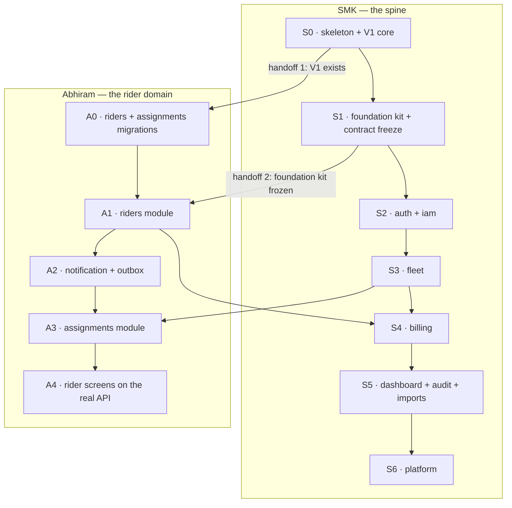

# Backend work split — SMK and Abhiram

**Companion to** [`BACKEND.md`](./BACKEND.md), which is the design. This file is only
about who does what, in what order, without ever touching the same file.

**The goal:** both people productive from day one, no file owned by two people, no
week where one waits on the other. Two handoffs in the whole plan, both dated.

---

## 1. The idea in one paragraph

The backend splits cleanly into a **spine** and a **rider domain**. The spine is
everything the platform needs to exist at all — the app skeleton, the database roles,
tenant isolation, login, the vehicle fleet, the money ledger. The rider domain is
everything about the people who rent the bikes — the register, onboarding, assignment,
and the messages we send them. SMK takes the spine because he owns the infrastructure
and the money rules today. Abhiram takes the rider domain because he already owns those
screens. They meet at two agreed interfaces and nowhere else.

Only two arrows cross the boundary downward (`S0→A0`, `S1→A1`) and two cross back
(`A1→S4`, `S3→A3`). Everything else runs in parallel.

---

## 2. Ownership — the hard lines

Nobody edits anything in the other column. Ever. If you need a change there, ask.

| Area | SMK | Abhiram |
|---|---|---|
| **Java packages** | `com.fleetech.common`, `.tenancy`, `.auth`, `.iam`, `.fleet`, `.billing`, `.dashboard`, `.audit`, `.imports`, `.platform` | `com.fleetech.riders`, `.assignments`, `.notification`, `.shared` |
| **Flyway migrations** | `V1–V29`, `V50–V69`, `V80–V89` | `V30–V49`, `V70–V79` |
| **Build and config** | `backend/pom.xml`, `application*.yml`, `docker-compose.yml`, `Dockerfile`, `.github/workflows/**` | none — request changes |
| **Security config** | `SecurityConfig`, filter chain, route matchers, `Permission` enum | none — guard your own controllers with `@PreAuthorize` only |
| **API contract** | `frontend/app/src/types/**`, `frontend/app/src/lib/api/**`, the OpenAPI spec | none — request changes |
| **Frontend pages** | `src/pages/vehicles`, `workshop`, `service`, `operations`, `recovery`, `payments`, `users`, `admin`, `Dashboard.tsx` | `src/pages/riders/**`, `src/pages/assignments/**` |
| **Frontend shared** | `src/theme`, `src/layouts`, `src/components`, `src/app`, `src/lib`, `src/mocks` | none — adopt, do not edit |

This is the BUILD.md ownership table extended to the backend. The one line that
changes: BUILD.md gives SMK all of `backend/**`. That is now split by package and
migration range as above.

### Why the migration ranges are what they are

Flyway runs files in version order, so a table must be created before anything that
points at it. The ranges encode the foreign-key order, not seniority:

| Range | Owner | Tables | Depends on |
|---|---|---|---|
| `V1–V19` | SMK | roles and grants, `tenants`, `plans`, `users`, `refresh_tokens`, `idempotency_keys`, `hubs`, `audit_events`, ShedLock, Modulith event log | — |
| `V20–V29` | SMK | `vehicles`, `vehicle_state_events`, `inspections`, `repair_jobs` | V1 |
| `V30–V39` | **Abhiram** | `riders`, `blacklist_entries` | V1 |
| `V40–V49` | **Abhiram** | `assignments` | V20, V30 |
| `V50–V59` | SMK | `billing_periods`, `ledger_entries`, `receipts` | V30 |
| `V60–V69` | SMK | `import_batches`, `import_batch_rows` | V1 |
| `V70–V79` | **Abhiram** | `outbox_messages` | V1 |
| `V80–V89` | SMK | views, extra indexes, the RLS sweep | all |

**A merged migration is never edited.** Wrong column, missing index, bad constraint —
all of it is a new file in your own range. This is the rule that makes two people
sharing one schema safe.

---

## 3. The two handoffs

Everything else is parallel. These two are not, so they are dated and small.

### Handoff 1 — "day-one unblock" (SMK → Abhiram, within 48 hours)

SMK's first commit, before anything else, is the bare minimum Abhiram needs to write a
migration at all:

- `backend/` Maven skeleton that boots and runs Flyway
- `docker-compose.yml` with `postgres:16` and MailHog
- `V1__roles_and_core.sql`: the two database roles (`fleetech_migrator`,
  `fleetech_app` with `NOBYPASSRLS`), `ALTER DEFAULT PRIVILEGES`, `tenants`, `plans`,
  `users`, and the RLS policy template as a comment block to copy

That is hours of work, not days, and it is the only thing standing between Abhiram and
a productive week one.

### Handoff 2 — "foundation kit" (SMK → Abhiram, end of week 1)

The contract between the two lanes. Once merged it is **frozen for Phase 1** — a change
to any of it is a conversation, not a commit.

| What | Package | Why Abhiram needs it |
|---|---|---|
| `ApiPage<T>`, `Problems.of(status, message, field)`, `Money`, `Ids.uuidv7()`, `Clock` bean | `common` | Every response and every error he returns |
| `TenantContext.currentTenantId()` and the transaction hook that issues `SET LOCAL` | `tenancy` | Transparent — but he must know reads run inside `@Transactional(readOnly = true)` |
| `Permission` enum, complete for Phase 1 from [`BACKEND.md` §5](./BACKEND.md#5-authorisation); `CurrentUser` | `iam` | `@PreAuthorize("hasAuthority('RIDER_WRITE')")` |
| `AuditWriter.record(...)` taking a field allow-list | `audit` | Onboarding and blacklist writes are audited (caveat S4) |
| `AbstractIntegrationTest` — Testcontainers Postgres, Flyway, both roles, `asTenant(...)`, `asUser(...)` | test | He cannot test RLS without it |
| `DomainEvent` base carrying `tenantId`, and the rule from caveat S3 | `common` | Every event he publishes |

**In the same week, SMK also lands the contract freeze**: the `src/types/` and
`src/lib/api/` changes forced by caveats **B1** (seven unbounded endpoints) and **B2**
(no optimistic-lock field), plus the mock updates so the frontend still builds and its
tests still pass. After that PR, `src/types/` does not move for the rest of Phase 1.
This is deliberate — a frozen contract is what lets two people build against it without
talking every day.

### The interfaces Abhiram publishes back

Defined by him in week 2, consumed by SMK in week 5. Signatures agreed at the
foundation-kit review so neither waits:

| What | Package | Who consumes |
|---|---|---|
| `RiderDirectoryPort.billableRiders(tenantId)` → projection of `riderId, code, name, phone, planAmountPaise, billingDay, paymentDay`; `riderSummary(code)` | `riders` | `billing` (S4) — the weekly run iterates this |
| `Notifier.queue(channel, recipient, templateId, payload)` | `notification` | `billing` for reminders, `auth` for password reset |
| Events `RiderOnboarded`, `VehicleAssigned`, `VehicleExchanged`, `RiderDeboarded`, each carrying `tenantId` | `assignments`, `riders` | `billing` closes periods pro-rata; `notification` queues messages |

Dependency direction is one-way throughout: `billing → riders`, `assignments → fleet`,
`assignments → riders`. Nothing points back. Spring Modulith's `verify()` test fails the
build if anyone creates a cycle, so this is enforced, not hoped for.

---

## 4. The lanes, week by week

Weeks are relative and assume part-time work on both sides. What matters is the order
and the two handoff points, not the calendar.

| Week | SMK | Abhiram | Parallel? |
|---|---|---|---|
| 1 | **S0** skeleton, compose, `V1` roles + core · **S1** foundation kit · contract freeze (B1, B2) | **A0** `V30` riders + blacklist, `V40` assignments, RLS policies on both, SQL tests that the constraints actually hold | Java vs SQL, different ranges — fully disjoint |
| 2 | **S2** auth: login, refresh rotation + reuse detection, CSRF (B3), JWKS, Argon2 · iam users list/patch · **the Netlify cookie spike (B4)** | **A1** riders module: register, list, facets, detail, onboarding, PII encryption + Aadhaar HMAC, KYC flags | disjoint packages |
| 3 | **S3** fleet: hubs, vehicles CRUD, state machine, `vehicle_state_events` | **A1** finish + `RiderDirectoryPort` · **A2** notification: outbox, `V70`, sender job with `SKIP LOCKED` · **start DLT registration with Ashok (B5)** | disjoint |
| 4 | **S3** fleet: inspections, repair jobs, QC queue and decision | **A2** finish: SMS and email adapters, templates, retry and dead-letter | disjoint |
| 5 | **S4** billing: periods, ledger, record payment with idempotency, receipts, overdue, dunning, the weekly job | **A3** assignments: assign, exchange, deboard as one transaction each; server-side money recompute on deboard | SMK consumes `RiderDirectoryPort` (ready wk3) · Abhiram consumes `FleetPort` (ready wk4) |
| 6 | **S5** dashboard aggregates and views (`V80`), audit list, imports: `.xlsx` preview and commit | **A4** rider and assignment screens onto the real API; delete those mocks | disjoint |
| 7 | **S6** platform: tenants and plans · his own screens onto the real API · 150-bike migration runbook | buffer, integration tests, whatever slipped | disjoint |

Both lanes move to real endpoints in week 6–7 rather than incrementally, because
`src/lib/api/client.ts` is the single swap point and it is SMK's file. One PR flips it;
each owner then deletes the mocks behind their own screens.

---

## 5. Definition of done, per slice

The same finish line on both sides, so neither has to review the other's judgement:

1. **Flyway migration** in your range, never edited after merge.
2. **RLS proved, not assumed** — a test that connects as `fleetech_app` with tenant B's
   id and asserts zero rows of tenant A's data. Not optional on any tenant table.
3. **Integration test per endpoint** on the Testcontainers harness: the happy path, the
   `403` for a role that lacks the permission, and the `409` for the state conflict.
4. **Problem Details on every failure path**, with `field` set where the frontend form
   needs it. A constraint violation that reaches the client as `500` is a bug (S5).
5. **OpenAPI matches** — CI regenerates types from the spec and diffs against
   `src/types/`; drift fails the build.
6. **`ApplicationModules.verify()` green** — no cross-module reach-in, no cycle.
7. **Audited** if the slice touches money, KYC, blacklist or roles, with the field
   allow-list applied (S4).

CI runs all of it on every push, same as the frontend does today.

---

## 6. Rules that keep this collision-free

- **Separate databases.** Each person runs their own Postgres from `docker-compose`.
  There is no shared dev database, so nobody's migration run breaks the other's.
- **Branch per slice**, PR into `main`, CI green before merge. Same as now.
- **Say it before you pull.** Unchanged from BUILD.md and it matters more now, because
  a migration that lands while you have an unrun one locally needs a
  `docker-compose down -v` and a rebuild, not a merge.
- **Never edit a merged migration.** Repair forward, in your own range.
- **No route-matcher edits by Abhiram.** The filter chain is one file and one mistake
  there disables authentication for everyone. Guard controllers with `@PreAuthorize`;
  if an endpoint needs to be public, ask SMK.
- **No new Maven dependency without asking.** One `pom.xml`, one owner.
- **If you need something from the other lane, write the interface first, stub it,
  and keep going.** Do not wait, and do not reach into their package.
- **The contract is frozen after week 1.** If a screen turns out to need a field, it is
  a conversation and a deliberate, batched change — not a quiet edit to `src/types/`.

---

## 7. What is not assigned yet, on purpose

- **The 150-bike data migration.** Needs Ashok's actual spreadsheet before anyone can
  size it. SMK's week 7 has the placeholder; it may be its own week.
- **DLT registration (B5).** Paperwork with Ashok's company documents, not code.
  Abhiram starts it in week 3 because `notification` is his, but it is Ashok's signature
  that unblocks it.
- **Hosting and the production database.** Vendor not chosen. SMK's call, needed by
  week 6, and nothing in the design depends on which one.
- **Answers from Ashok** — the billing-day question and whether a returning rider is
  reactivated or re-onboarded. Both are flagged in
  [`BACKEND.md` §14](./BACKEND.md#14-open-questions-and-stated-assumptions) and neither
  blocks a migration.
